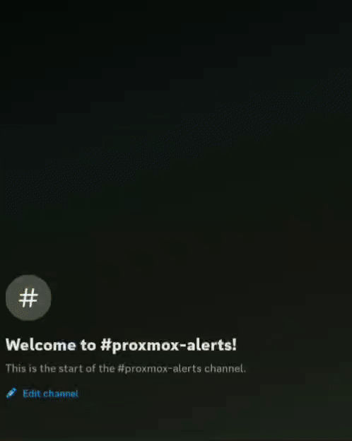

# Semaphore-Discord-Bot

A Discord bot that bridges Discord interactions with SemaphoreUI automation, allowing users to trigger Ansible playbooks directly from Discord using interactive buttons.

## Overview

This project is implemented in **Node.js** using [discord.js](https://discord.js.org/). It provides a persistent Discord bot that supports slash commands and interactive buttons to trigger SemaphoreUI webhooks directly from Discord.



*Interactive Discord bot triggering infrastructure automation through SemaphoreUI*

## Features

- Trigger SemaphoreUI playbooks via Discord button interactions
- Slash command `/playbooks` in Discord to bring up interactive playbook buttons
- Docker deployment ready

## Requirements

- Node.js 18+ (or latest LTS)
- Docker (optional, for containerized deployment)
- A Discord application with a bot token
- SemaphoreUI environment with configured 'Integrations' for your playbooks

## Setup

1. **Clone the repository:**
   ```sh
   git clone https://github.com/adam-beckett-1999/semaphore-discord-bot.git
   cd semaphore-discord-bot
   ```

2. **Install dependencies:**
   ```sh
   npm install
   ```

3. **Configure environment variables:**

   Create a `.env` file in the project root:
   ```
   DISCORD_SEMAPHORE_CONTROL_BOT_TOKEN=your_discord_bot_token_here
   DISCORD_CLIENT_ID=your_discord_client_id_here
   DISCORD_SERVER_ID=your_discord_server_id_here
   SEMAPHORE_VMS_LXCS_UPDATE_TRIGGER_URL=your_semaphore_trigger_url_here
   SEMAPHORE_PVE_CLUSTERS_UPDATE_TRIGGER_URL=your_semaphore_trigger_url_here
   SEMAPHORE_PHYSICAL_HOSTS_UPDATE_TRIGGER_URL=your_semaphore_trigger_url_here
   SEMAPHORE_VMS_LXCS_UPDATE_REPORT_TRIGGER_URL=your_semaphore_report_trigger_url_here
   SEMAPHORE_PVE_CLUSTERS_UPDATE_REPORT_TRIGGER_URL=your_semaphore_report_trigger_url_here
   SEMAPHORE_PHYSICAL_HOSTS_UPDATE_REPORT_TRIGGER_URL=your_semaphore_report_trigger_url_here
   ```

## Running Locally

To run the bot:
```sh
npm start
```

## Docker

Build and run the container:

```sh
docker build -t semaphore-discord-command-bot .
docker run --env-file .env semaphore-discord-command-bot
```

## Endpoints

- Discord slash command `/playbooks`  
  Brings up a menu of buttons in Discord to trigger SemaphoreUI webhooks.

## How It Works

1. **Users use the `/playbooks` slash command** in Discord to bring up interactive buttons
2. **Users click buttons** in Discord to trigger playbooks
3. **Bot receives the interaction, handles via gateway (discord.js), and calls SemaphoreUI webhooks**
4. **SemaphoreUI** executes the corresponding Ansible playbooks
5. **Users receive feedback** in Discord about the operation status

## Ansible Playbooks

This ties in with my playbooks and roles which can be found here: https://github.com/adam-beckett-1999/Ansible-Playbooks

## Contributing

Feel free to fork and adapt to suit your needs. This is fairly basic and will probably be improved upon over time to make it more generalised.

## License

This project is open source. Please check the license file for more details.
